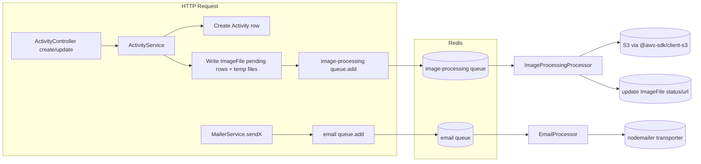

# Plan: Queue Processor for Email & Activity Image Processing

## Decisions (confirmed with user)
- Queue backend: **BullMQ + Redis** (new Redis service in docker-compose).
- Email scope: only `MailerService` methods (`sendResetPasswordConfirmation`, `sendPasswordResetEmail`, `sendRegistrationEmail`) and `SupportRequestService` go through the queue. Better Auth's own `sendResetPassword`/`sendVerificationEmail` hooks in `auth.ts` stay synchronous (framework-managed callbacks, out of scope).
- Image scope: add real processing (compression/resize via `sharp`) in addition to moving S3 upload off the request thread. Also migrate `UploadService` from `aws-sdk` v2 to already-installed-but-unused `@aws-sdk/client-s3` v3 while touching this code.
- API contract: activity create/update responses no longer contain final image URLs synchronously. `ImageFile` gets a `status` (`pending`/`completed`/`failed`) so the frontend can refetch/poll until processing completes.
- File payload handling: Multer buffers are written to a local temp dir (`os.tmpdir()`) synchronously before the job is enqueued (BullMQ persists job data in Redis, buffers are too large/unsafe to pass directly). Processor reads the temp file, compresses, uploads, updates DB, deletes temp file. Documented as a known limitation for horizontal scaling (needs shared volume/S3-raw-then-process approach if backend is ever scaled to multiple replicas) — acceptable now since only one backend container runs.

## Architecture Overview

**Steps**

### Phase 1 — Queue infrastructure (foundation, blocks everything else)
1. Add `redis` service to `docker-compose.dev.yml`, `docker-compose.prod.yml`, `docker-compose.yml` (image `redis:7-alpine`, exposed only on internal network, volume for persistence in prod).
2. Add env vars: `REDIS_HOST`, `REDIS_PORT`, `REDIS_PASSWORD` (optional) to `portal-backend/src/envvars.ts` and `.env` templates.
3. Install packages in `portal-backend`: `@nestjs/bullmq`, `bullmq`, `sharp`, `@aws-sdk/s3-request-presigner` (if signed URL generation needs v3 equivalent). Remove `aws-sdk` (v2) once migration is complete (Phase 3).
4. Create `portal-backend/src/queue/queue.module.ts` — `BullModule.forRootAsync` reading Redis config from `ConfigService`, exported as a global-ish module imported by feature modules.
5. Create `portal-backend/src/queue/queue.constants.ts` — queue name constants: `EMAIL_QUEUE`, `IMAGE_PROCESSING_QUEUE`, and job-name constants (`SEND_RESET_PASSWORD_CONFIRMATION`, `SEND_PASSWORD_RESET`, `SEND_REGISTRATION`, `SEND_SUPPORT_REQUEST`, `PROCESS_ACTIVITY_IMAGE_UPLOAD`, `PROCESS_ACTIVITY_IMAGE_DELETE`).
6. Register `BullModule.registerQueue({ name: EMAIL_QUEUE })` and `{ name: IMAGE_PROCESSING_QUEUE }` in the relevant feature modules (Utils/Email module, Image module).

### Phase 2 — Email queue (parallel with Phase 3, both depend on Phase 1)
1. Create `portal-backend/src/utils/services/email.processor.ts` — `@Processor(EMAIL_QUEUE)` class with a `process()` (or per-job `@Process(jobName)`) method per job name, calling the existing low-level `sendEmail()` in `transporter.ts` with the right subject/template per job type.
2. Update `portal-backend/src/utils/services/mailer.services.ts` — convert `sendResetPasswordConfirmation`, `sendPasswordResetEmail`, `sendRegistrationEmail` from directly calling `transporter.sendMail`/`sendEmail` to instead `queue.add(jobName, payload, { attempts: 3, backoff: { type: 'exponential', delay: 2000 } })`. Inject `@InjectQueue(EMAIL_QUEUE) private queue: Queue` into `MailerService`.
3. Update `portal-backend/src/utils/util.module.ts` — import `BullModule.registerQueue({ name: EMAIL_QUEUE })`, add `EmailProcessor` to providers/exports.
4. Update `portal-backend/src/support/support.module.ts` and `support.service.ts` — import `UtilsModule`, inject `MailerService` (or a queue directly) instead of calling `sendEmail` from `transporter.ts` directly; add a `sendSupportRequestEmail` method to `MailerService` that enqueues.
5. Leave `portal-backend/auth.ts` Better Auth hooks (`sendResetPassword`, `sendVerificationEmail`) untouched (explicit scope exclusion).

### Phase 3 — Image processing queue (parallel with Phase 2, depends on Phase 1)
1. Migration: add `status` column (enum: `pending`, `completed`, `failed`, default `pending`) to `ImageFile` entity (`portal-backend/src/image/entities/image-file.entity.ts`); make `url`/`key` nullable until processing completes. Run `task db:migration:generate -- add-status-to-image-file` from `portal-backend`.
2. Migrate `portal-backend/src/upload/service/upload.service.ts` from `aws-sdk` v2 (`this.s3.upload(...).promise()`) to `@aws-sdk/client-s3` (`PutObjectCommand`, `DeleteObjectCommand`, `GetObjectCommand` + `@aws-sdk/s3-request-presigner` for signed URLs) — same method signatures so callers don't change.
3. Add compression step: new `portal-backend/src/image/services/image-compression.service.ts` wrapping `sharp` (resize to max dimension, convert to webp/jpeg quality N) — used only by the processor, not inline in the controller.
4. Create `portal-backend/src/image/processors/image-processing.processor.ts` — `@Processor(IMAGE_PROCESSING_QUEUE)`:
   - job `PROCESS_ACTIVITY_IMAGE_UPLOAD`: read temp file path from job payload → compress via `ImageCompressionService` → upload via `UploadService.upload` → update the matching `ImageFile` row (`status: completed`, `url`, `key`) via `ImageFileService` → delete temp file (in `finally`, including on failure).
   - job `PROCESS_ACTIVITY_IMAGE_DELETE`: delete from S3 via `UploadService.deleteUploadFile`, then delete the `ImageFile` row.
   - On repeated failure (BullMQ `attempts` exhausted), mark `ImageFile.status = 'failed'` in a `@OnQueueFailed`/`failed` event handler so the frontend can show an error state instead of infinite pending.
5. Create `portal-backend/src/image/services/image-queue.service.ts` — producer with `enqueueImageUpload(payload)` / `enqueueImageDelete(payload)`, injecting `@InjectQueue(IMAGE_PROCESSING_QUEUE)`.
6. Update `portal-backend/src/image/image.module.ts` — import `BullModule.registerQueue({ name: IMAGE_PROCESSING_QUEUE })`, register `ImageProcessingProcessor`, `ImageCompressionService`, `ImageQueueService` as providers, export `ImageQueueService`.
7. Update `portal-backend/src/activity/service/activity.service.ts`:
   - `createActivity()` (~line 60-115): after creating the `Activity` row, for each incoming file — write buffer to `os.tmpdir()` with a uuid filename, create a placeholder `ImageFile` row (`status: pending`, `url`/`key` null), then call `imageQueueService.enqueueImageUpload({ activityId, imageFileId, tempFilePath, userId, originalFilename })`. Remove the current synchronous `Promise.all` upload block.
   - `updateActivity()` (~line 275-330) and helpers `deleteActivityImages`/`uploadActivityImages` (~line 386-465): same pattern — deletions enqueue `PROCESS_ACTIVITY_IMAGE_DELETE` jobs instead of awaiting S3 delete inline; new uploads follow the same placeholder-row + enqueue pattern as create.
8. Update `portal-backend/src/activity/controllers/activity.controller.ts` create/update responses to reflect that returned `ImageFile`s may have `status: pending` (no contract break, just document nullable `url`).

### Phase 4 — Frontend adjustments (depends on Phase 3 API shape)
1. Update `CategoryResponseDto`-style DTO / activity image DTO on frontend (`frontend/src/app/api-service/`) to include `status` field.
2. Update activity detail/list components to show a "processing" placeholder/spinner for images with `status: pending`, and either poll the activity endpoint (simple `setInterval`/react-query refetch interval while any image is pending) or require manual refresh — recommend short-interval polling (e.g. every 3s, stop once all images are `completed`/`failed`) using existing data-fetching hook.
3. Handle `status: failed` with a retry-or-remove affordance (at minimum, show an error icon).

### Phase 5 — Verification & cleanup
1. Unit tests: `EmailProcessor`, `ImageProcessingProcessor`, `ImageCompressionService` (mock `sharp`/S3 client), updated `ActivityService` tests (assert queue `.add()` called instead of direct upload).
2. Integration/e2e: extend `portal-backend/test/activity/*` to assert `ImageFile` created with `status: pending` and no longer awaiting S3.
3. Manual QA: create activity with images locally (`task dev:start` with new redis service), confirm image transitions pending → completed in DB/UI; kill Redis mid-job to confirm retry/backoff and `failed` status path; trigger password reset/support request and confirm emails still arrive via queue.
4. Remove `aws-sdk` (v2) from `portal-backend/package.json` once nothing references it.
5. Optional/nice-to-have (flag, don't implement unless asked): Bull Board or `@bull-board/nestjs` for visual queue monitoring in non-prod.

**Relevant files**
- `docker-compose.dev.yml`, `docker-compose.prod.yml`, `docker-compose.yml` — add `redis` service.
- `portal-backend/src/envvars.ts` — add `REDIS_HOST`/`REDIS_PORT`/`REDIS_PASSWORD`.
- `portal-backend/src/queue/queue.module.ts` (new), `portal-backend/src/queue/queue.constants.ts` (new).
- `portal-backend/src/utils/services/mailer.services.ts` — convert direct sends to `queue.add()`.
- `portal-backend/src/utils/services/email.processor.ts` (new) — actual send logic, consumes `EMAIL_QUEUE`.
- `portal-backend/src/utils/util.module.ts` — register queue + processor.
- `portal-backend/src/support/support.module.ts`, `support.service.ts` — route through `MailerService`/queue.
- `portal-backend/src/image/entities/image-file.entity.ts` — add `status`, nullable `url`/`key`; new migration in `portal-backend/sql/db_migrations/`.
- `portal-backend/src/upload/service/upload.service.ts` — migrate to `@aws-sdk/client-s3`.
- `portal-backend/src/image/services/image-compression.service.ts` (new) — `sharp` wrapper.
- `portal-backend/src/image/processors/image-processing.processor.ts` (new), `portal-backend/src/image/services/image-queue.service.ts` (new).
- `portal-backend/src/image/image.module.ts` — register queue, processor, new services.
- `portal-backend/src/activity/service/activity.service.ts` — replace inline `Promise.all` upload/delete with temp-file write + enqueue (createActivity ~L60-115, updateActivity ~L275-330, uploadActivityImages ~L433-465, deleteActivityImages ~L386-431).
- `portal-backend/src/activity/controllers/activity.controller.ts` — no signature change, response shape note only.
- `portal-backend/package.json` — add `@nestjs/bullmq`, `bullmq`, `sharp`, `@aws-sdk/s3-request-presigner`; remove `aws-sdk`.
- Frontend: activity image DTO/types + list/detail components under `frontend/src/app/webapp/` (whichever renders activity images) — add `status`-aware rendering + polling.

**Verification**
1. `task db:migration:generate -- add-status-to-image-file` then `task db:migration:up` runs cleanly against local Postgres.
2. `cd portal-backend && npm run test` — new/updated unit tests for `EmailProcessor`, `ImageProcessingProcessor`, `ActivityService` pass.
3. `cd portal-backend && npm run test:e2e` — activity create/update e2e reflects async image flow (`status: pending` immediately, `completed` after processor runs in test).
4. `task dev:start` — manually create an activity with an image via the frontend, confirm image appears after brief delay (processing indicator → final image), confirm password-reset/support emails still deliver.
5. Kill/stop the `redis` container mid-flight to confirm activity creation still succeeds (job just queues once Redis is back, or job fails gracefully) and no HTTP 500 is thrown due to queue unavailability at request time (`queue.add` should not block the response if Redis briefly hiccups — verify connection retry strategy in `queue.module.ts`).

**Further Considerations**
1. Scaling limitation: temp-file-on-local-disk approach assumes a single backend container/replica. If the backend is ever scaled horizontally, switch to uploading the raw file to S3 synchronously (fast) and have the processor download-transform-reupload, or use a shared volume/NFS for temp files. Flagged as accepted tech debt per user's confirmed scope, not addressed now.
2. Retry/backoff policy defaults (3 attempts, exponential backoff starting at 2s) are a reasonable default — confirm with user if different SLAs are needed for email deliverability vs image processing.
3. Bull Board / queue monitoring UI was not requested — left as an optional follow-up, not part of this plan's execution checklist.
